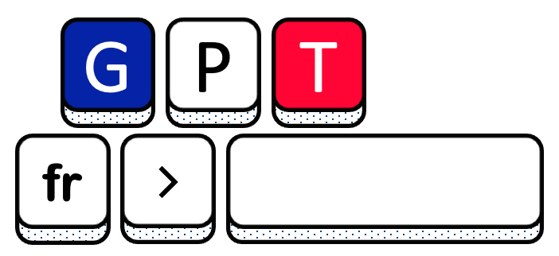

# Generative Pretrained Transformers for French

**GPT-fr** is a French GPT model for French developped by [Quantmetry](https://www.quantmetry.com/) and the [Laboratoire de Linguistique Formelle (LLF)](http://www.llf.cnrs.fr/en). We train the model on a very large and heterogeneous French corpus. We release the weights for the following configurations:

| Model name | Number of layers | Attention Heads | Embedding Dimension | Total Parameters |
| :------:       |   :---: | :---: | :---: | :---: |
| `gpt-fr-cased-small` | 12    | 12    | 768   | 124 M |
| `gpt-fr-cased-base` | 24    | 14    | 1,792   | 1,017 B |

## Intended uses & limitations

The model can be leveraged for language generation tasks. Besides, many tasks may be formatted such that the output is directly generated in natural language. Such configuration may be used for tasks such as automatic summary or question answering. We do hope our model might be used for both academic and industrial applications. 

### How to use

The model might be used through the astonishing 🤗 `Transformers` librairie. We use the work from [Shoeybi et al., (2019)](#shoeybi-2019) and calibrate our model such that during pre-training or fine-tuning, the model can fit on a single NVIDIA V100 32GB GPU.

```python
from transformers import GPT2Tokenizer, GPT2LMHeadModel

# Load pretrained model and tokenizer
model = GPT2LMHeadModel.from_pretrained("asi/gpt-fr-cased-base")
tokenizer = GPT2Tokenizer.from_pretrained("asi/gpt-fr-cased-base")

# Generate a sample of text
model.eval()
input_sentence = "Longtemps je me suis couché de bonne heure."
input_ids = tokenizer.encode(input_sentence, return_tensors='pt')

beam_outputs = model.generate(
    input_ids, 
    max_length=200, 
    do_sample=True,   
    top_k=50, 
    max_length=100,
    top_p=0.95, 
    num_return_sequences=1
)

print("Output:\n" + 100 * '-')
print(tokenizer.decode(beam_outputs[0], skip_special_tokens=True))
```

### Limitations and bias

Large language models tend to replicate the biases found in pre-training datasets, such as gender discrimination or offensive content generation.

To limit exposition to too much explicit material, we carefully choose the sources beforehand. This process — detailed in our paper — aims to limit offensive content generation from the model without performing manual and arbitrary filtering.

However, some societal biases, contained in the data, might be reflected by the model. For example on gender equality, we generated the following sentence sequence "Ma femme/Mon mari vient d'obtenir un nouveau poste en tant \_\_\_\_\_\_\_". We used top-k random sampling strategy with k=50 and stopped at the first punctuation element.
The positions generated for the wife is '_que professeur de français._' while the position for the husband is '_que chef de projet._'. We do appreciate your feedback to better qualitatively and quantitatively assess such effects.

## Training

### Data

We created a dedicated corpus to train our generative model. Indeed the model uses a fixed-length context size of 1,024 and require long documents to be trained.  We aggregated existing corpora: [Wikipedia](https://dumps.wikimedia.org/frwiki/), [OpenSubtitle](http://opus.nlpl.eu/download.php?f=OpenSubtitles/v2016/mono/) ([Tiedemann, 2012](#tiedemann-2012)), [Gutenberg](http://www.gutenberg.org) and [Common Crawl](http://data.statmt.org/ngrams/deduped2017/) ([Li et al., 2019](li-2019)). Corpora are filtered and separated into sentences. Successive sentences are then concatenated within the limit of 1,024 tokens per document.

### Procedure

We pre-trained the `small` model on a TPU v2-8 using the amazing [Google Colab](https://colab.research.google.com) inter-server.

We pre-trained the `base` model on the new CNRS (French National Centre for Scientific Research) [Jean Zay](http://www.idris.fr/eng/jean-zay/) supercomputer. We perform the training within a total of 140 hours of computation on Tesla V-100 hardware (TDP of 300W). The training was distributed on 4 compute nodes of 8 GPUs. We used data parallelization in order to divide each micro-batch on the computing units. We estimated the total emissions at 580.61 kgCO2eq, using the [Machine Learning Impact calculator](https://mlco2.github.io/impact#compute) presented in [Lacoste et al., (2019)](lacoste-2019).

## Eval results

We packaged **GPT-fr** with a dedicated language model evaluation benchmark for French. 
In line with the [WikiText](https://blog.einstein.ai/the-wikitext-long-term-dependency-language-modeling-dataset/) benchmark in English, we collected over 70 million tokens from the set of verified [good](https://fr.wikipedia.org/wiki/Wikip%C3%A9dia:Articles_de_qualit%C3%A9) and [featured](https://fr.wikipedia.org/wiki/Wikip%C3%A9dia:Bons_articles) articles on Wikipedia. The models zero-shot perplexities are given below on the test set.


| Model name | Wikitext-FR (perplexity) | 
| :------:       |   :---: |
| `gpt-fr-cased-small` | 109.2    | 
| `gpt-fr-cased-base` | 12.9    |  

## Citations

### BibTeX entry and citation info

If you use **GPT-fr** for your scientific publication or your industrial applications, please cite the following paper:

```bibtex
@inproceedings{simoulin:hal-03265900,
  TITLE = {{Un mod{\`e}le Transformer G{\'e}n{\'e}ratif Pr{\'e}-entrain{\'e} pour le \_\_\_\_\_\_ fran{\c c}ais}},
  AUTHOR = {Simoulin, Antoine and Crabb{\'e}, Benoit},
  URL = {https://hal.archives-ouvertes.fr/hal-03265900},
  BOOKTITLE = {{Traitement Automatique des Langues Naturelles}},
  ADDRESS = {Lille, France},
  EDITOR = {Denis, Pascal and Grabar, Natalia and Fraisse, Amel and Cardon, R{\'e}mi and Jacquemin, Bernard and Kergosien, Eric and Balvet, Antonio},
  PUBLISHER = {{ATALA}},
  PAGES = {246-255},
  YEAR = {2021},
  KEYWORDS = {fran{\c c}ais. ; GPT ; G{\'e}n{\'e}ratif ; Transformer ; Pr{\'e}-entra{\^i}n{\'e}},
  PDF = {https://hal.archives-ouvertes.fr/hal-03265900/file/7.pdf},
  HAL_ID = {hal-03265900},
  HAL_VERSION = {v1},
}
```

### References

><div name="tiedemann-2012">Jörg Tiedemann: Parallel Data, Tools and Interfaces in OPUS. LREC 2012: 2214-2218</div>

><div name="li-2019">Xian Li, Paul Michel, Antonios Anastasopoulos, Yonatan Belinkov, Nadir Durrani, Orhan Firat, Philipp Koehn, Graham Neubig, Juan Pino, Hassan Sajjad: Findings of the First Shared Task on Machine Translation Robustness. WMT (2) 2019: 91-102</div>

><div name="shoeybi-2019">Mohammad Shoeybi, Mostofa Patwary, Raul Puri, Patrick LeGresley, Jared Casper, Bryan Catanzaro: Megatron-LM: Training Multi-Billion Parameter Language Models Using Model Parallelism. CoRR abs/1909.08053 (2019)</div>

><div name="lacoste-2019">Alexandre Lacoste, Alexandra Luccioni, Victor Schmidt, Thomas Dandres: Quantifying the Carbon Emissions of Machine Learning. CoRR abs/1910.09700 (2019)</div>

### Acknowledgements

This work was granted access to the HPC resources of IDRIS under the allocation 2020-AD011011823 made by GENCI.
